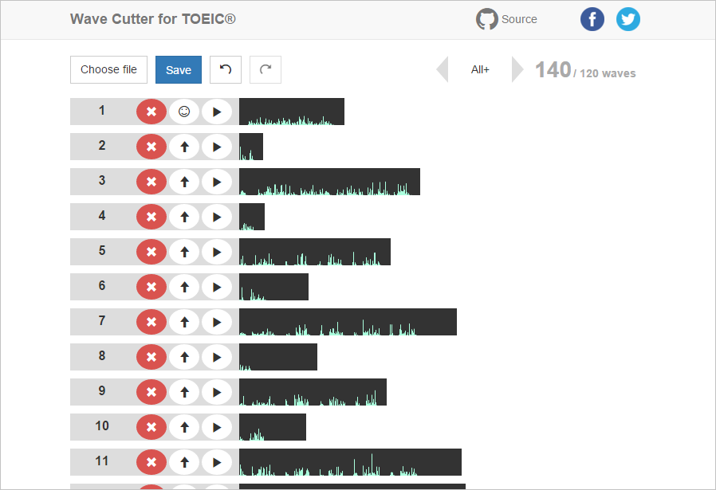

# Wave Cutter for TOEIC&reg;

A tool for cutting wave of listening CD. This may be useful when you seek and repeat one problem.

**[Try it!](http://jinjor.github.io/wave-cutter-for-toeic)**

## Usage

1. Load your MP3 file. It's wave will be cut automatically.
2. You'll need to edit cutting points manually.
3. Generate ZIP file that contains all waves in form of MP3.

About 2, you can think it's a kind of game of matching file names and waves.

### Naming rules

You can choose naming rules from below.

|Rule|Goal|Names|
|:--|:--|:--|
|All|60|1, 2, 3, ..., 41-43, 44-46, ... 98-100|
|All+|120|1, 2, 3, ..., 41-43, 41, 42, 43, 44-46, 44, 45, 46, ... 98-100, 98, 99, 100|
|Part1|10|1, 2, 3, ..., 10|
|Part2|30|11, 12, 13, ..., 40|
|Part3|10|41-43, 44-46, ..., 68-70|
|Part3+|40|41-43, 41, 42, 43, 44-46, 44, 45, 46, ..., 68-70, 68, 69, 70|
|Part4|10|71-73, 74-76, ..., 98-100|
|Part4+|40|71-73, 71, 72, 73, 74-76, 74, 75, 76, ..., 98-100, 98, 99, 100|
|From X|-|X, X+1, X+2, ...|

## Support

### Browsers

|Browser|Supported|
|:--|:--|
|Chrome|✓|
|Firefox|✓|
|Edge|✓|
|Safari|Not tested|
|Opera|Not tested|
|IE8-11|✗|
|Mobile browsers|Not supported|

### Decoding format

|Format|Supported|
|:--|:--|
|.mp3|✓|
|.ogg|Not tested|
|.aac|Not tested|
|.wav|Not tested|
|other formats|Not supported|

### Encoding format

|Format|Supported|
|:--|:--|
|.mp3|✓|
|other formats|Not supported|

